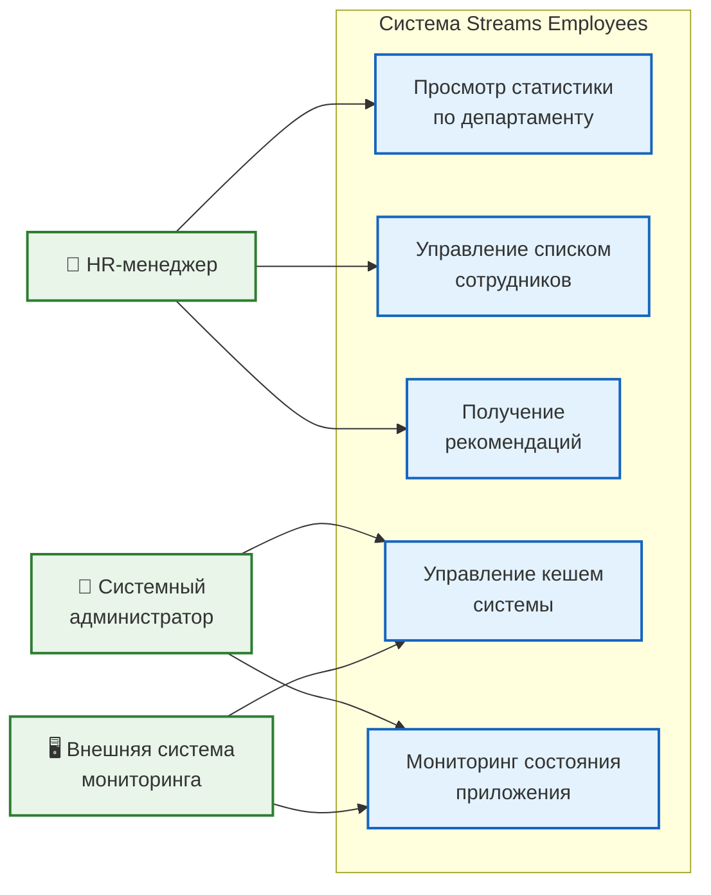
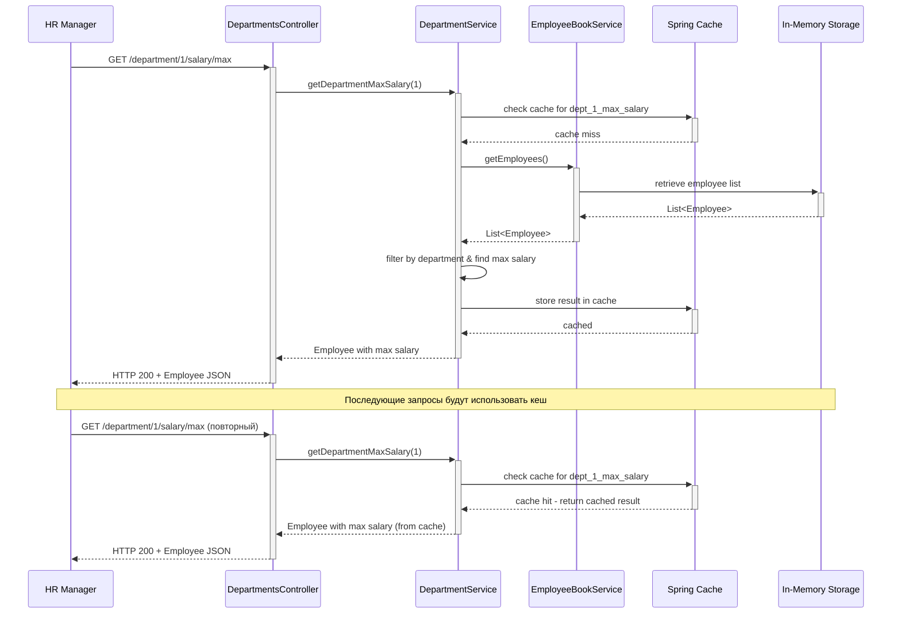
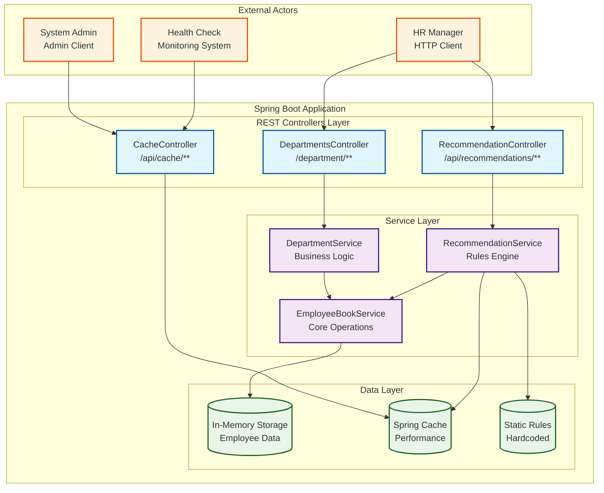
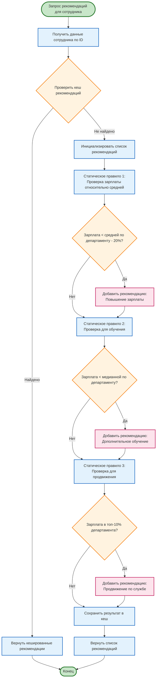

# Архитектура приложения Streams Employees

## Use Case Diagramm

## Диаграмма последовательности 

## Диаграмма компонентов

## Диаграмма деятельности - Генерация рекомендаций

## Описание компонентов

### REST Controllers
- **DepartmentsController**: Обрабатывает запросы для работы с департаментами и статистикой
- **RecommendationController**: Генерирует и возвращает рекомендации для сотрудников
- **CacheController**: Управление кешем системы

### Service Layer
- **EmployeeBookServiceImpl**: Основная бизнес-логика работы с сотрудниками
- **DepartmentServiceImpl**: Специализированная логика работы с департаментами
- **RecommendationService**: Движок генерации рекомендаций на основе правил

### Data Layer
- **In-Memory Storage**: Хранение данных сотрудников в памяти приложения
- **Spring Cache**: Кеширование результатов для повышения производительности

## Принципы архитектуры

1. **Layered Architecture** - четкое разделение на слои контроллеров, сервисов и данных
2. **Dependency Injection** - использование Spring DI для управления зависимостями
3. **RESTful API** - следование принципам REST для API endpoints
4. **Caching Strategy** - кеширование для оптимизации производительности
5. **Exception Handling** - централизованная обработка исключений

